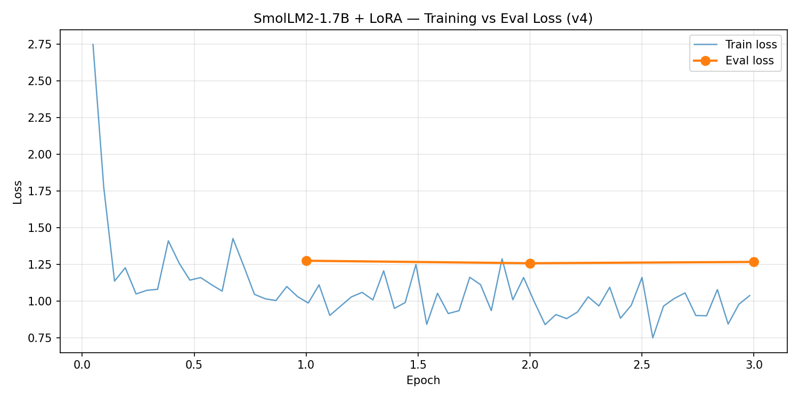
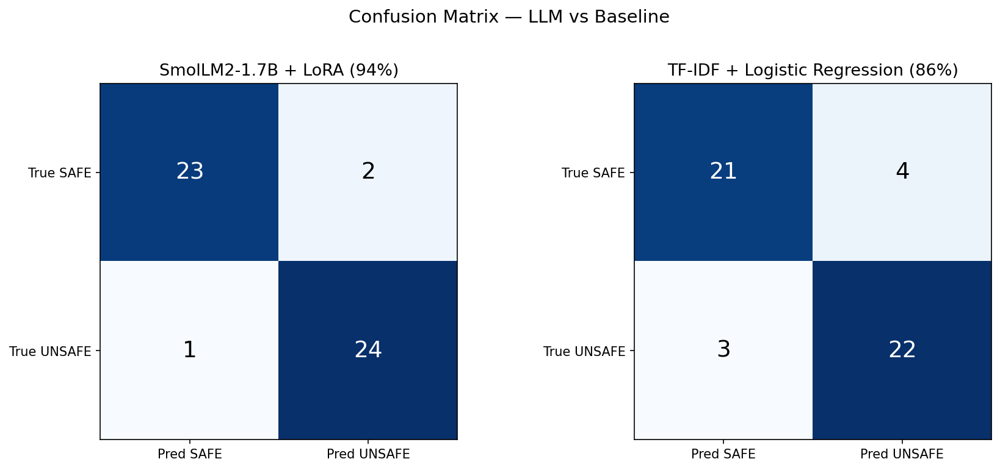
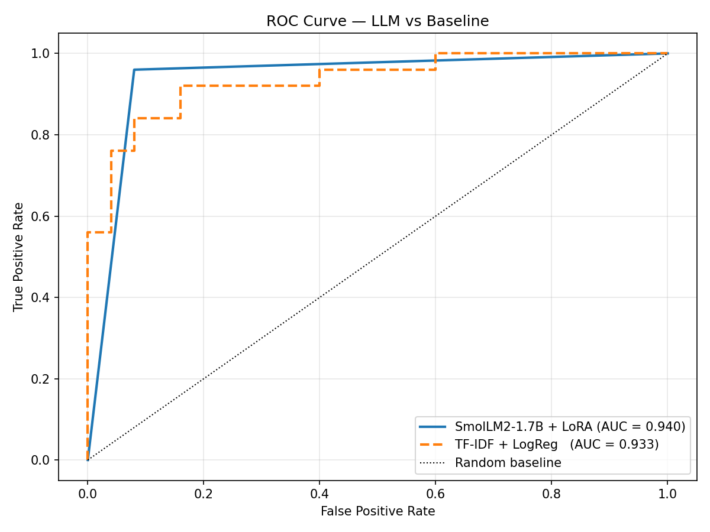

# Phishing URL Classifier

Fine-tuned SmolLM2-1.7B with LoRA/QLoRA to detect phishing URLs.
Benchmarked against a TF-IDF + Logistic Regression baseline on a held-out test set.

**[Notebook →](phishing_classifier_v4.ipynb)**

---

## Results

| Model | Accuracy | AUC | False Negatives | False Positives |
|---|---|---|---|---|
| SmolLM2-1.7B + LoRA (v4) | **47/50 (94%)** | **0.940** | 1 | 2 |
| TF-IDF + Logistic Regression | 43/50 (86%) | 0.933 | 3 | 4 |
| SmolLM2-1.7B + LoRA (v3) | 17/20 (85%) | — | — | — |

LLM outperforms the classical baseline by 8 points in accuracy. More importantly, it produces fewer false negatives — the higher-cost error in phishing detection, where a missed threat reaches the user.

---

## Loss Curve

Training loss dropped from 2.77 → 0.84 across 3 epochs. Eval loss plateaued at 1.26 — mild overfitting consistent with a 415-example training set. Best checkpoint selected at epoch 2 (eval loss 1.258).

---

## Confusion Matrices

---

## ROC Curve

The LLM curve is tighter in the top-left corner — the operating region that matters for phishing detection, where high recall must be maintained at low false positive rates.

---

## What Changed v3 → v4

- **Dataset:** 120 → 415 training examples (250/250 balanced + 15 targeted edge cases)
- **Split:** proper 80/10/10 train/val/test; v3 had no held-out split
- **LoRA targets:** added `k_proj`, `o_proj`, `up_proj`, `down_proj` on top of `q_proj`, `v_proj`
- **Validation tracking:** eval loss logged per epoch; best checkpoint loaded at end
- **Baseline:** TF-IDF + Logistic Regression trained on same data for direct comparison

---

## Edge Cases Targeted

Three failure modes from v3 were addressed with 5 targeted training examples each:

| Failure mode | Example | v3 | v4 |
|---|---|---|---|
| Homoglyph substitution | `picass0.com/rtl/sign.php` | ✗ | ✓ |
| WordPress path abuse | `ralucatodorut.com/wp-includes/mmc.htm` | ✗ | ✓ |
| Redirect obfuscation | `astra-antiques.com/bt32u5` | ✗ | ✓ |

---

## Remaining Failure Analysis

| URL | Expected | Got | Why |
|---|---|---|---|
| popvideoskype.info | UNSAFE | SAFE | Bare domain, no path signals |
| filtraguide.com/en/22/ext/... | SAFE | UNSAFE | False positive — legitimate industrial site |
| google.com/finance?cid=657111 | SAFE | UNSAFE | False positive on clean Google URL |

---

## Model

- **Base:** HuggingFaceTB/SmolLM2-1.7B-Instruct
- **Method:** QLoRA 4-bit quantization, LoRA rank 8, alpha 16
- **Target modules:** `q_proj`, `v_proj`, `k_proj`, `o_proj`, `up_proj`, `down_proj`
- **Training:** 3 epochs, lr 2e-4, batch size 2, Google Colab T4 GPU
- **Dataset:** shawhin/phishing-site-classification

## Stack

`Python` `HuggingFace Transformers` `PEFT` `TRL` `scikit-learn` `Google Colab`

---

## Author

Kazumasa Iinuma — Applied Mathematics, Boston University
[GitHub](https://github.com/kiinuma) · [LinkedIn](https://linkedin.com/in/kazumasa-iinuma)
